## Hi there 🖐
- 🏫 A 18 y.o. senior high school student
- 🎲 只会一点点🤏Java
- ✈️ 我干啥都是菜鸡一枚
- ### PGP fingerprints:
  - `B579 D114 D4D2 1F39 88E3 C0AB 4960 6E56 CC64 37A0`
  - `F772 CB69 7E95 818C A31B D4C6 9BBA 4262 3E40 4376`
    

## 📫 联系我
  - 
  - 
  - 
## 🦾 我最~~强~~菜的语言
  - 

## 📈 ~~我写出BUG最多~~最常用的语言

## ⏲️ 每周的~~摸鱼~~时长:

## Thanks to all visitors  

